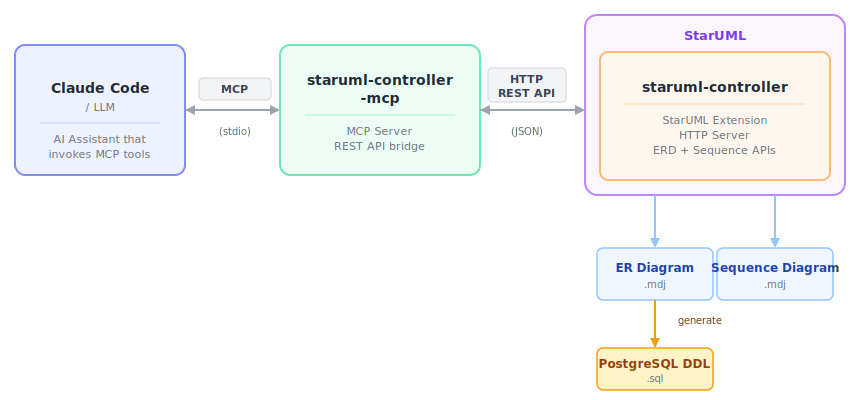

# StarUML Controller MCP Server

An MCP (Model Context Protocol) server that exposes all endpoints of [StarUML Controller](https://github.com/pontasan/staruml-controller) as 873 tools. This enables AI assistants like Claude to programmatically create and edit any StarUML diagram — UML, ERD, Sequence, BPMN, C4, SysML, Wireframe, MindMap, AWS, Azure, GCP, Flowchart, DFD, and more.

<p align="center">
  
  <br>
  <em>An AI tool creating a complete Web Shopping ER diagram through the StarUML Controller API</em>
</p>

<p align="center">
  
  <br>
  <em>PostgreSQL DDL exported from the ER diagram</em>
</p>

<p align="center">
  
  <br>
  <em>An AI tool analyzing source code and generating a sequence diagram</em>
</p>

## Architecture Overview

<p align="center">
  
</p>

## Prerequisites

- **Node.js 18+**
- **StarUML** with the [StarUML Controller](https://github.com/pontasan/staruml-controller) extension installed and running

## Setup

```bash
git clone https://github.com/pontasan/staruml-controller-mcp.git
cd staruml-controller-mcp
npm install
npm run build
```

## Starting the StarUML Controller Server

Before using the MCP server, you need to start the StarUML Controller server:

1. **Launch StarUML** and open a project (or create a new one)

2. From the menu bar, select **Tools > StarUML Controller > Start Server...**

<p align="center">
  
</p>

3. A dialog appears asking for the port number. Enter a port (default: `12345`) and click **OK**

<p align="center">
  
</p>

4. The HTTP server starts and all diagrams become accessible via the MCP tools

To stop, select **Tools > StarUML Controller > Stop Server** from the menu bar.

## Usage with Claude Desktop

Add the following to your Claude Desktop configuration file:

- macOS: `~/Library/Application Support/Claude/claude_desktop_config.json`
- Windows: `%APPDATA%\Claude\claude_desktop_config.json`

```json
{
  "mcpServers": {
    "staruml-controller": {
      "command": "node",
      "args": ["/absolute/path/to/staruml-controller-mcp/dist/index.js"]
    }
  }
}
```

## Usage with Claude Code

Add the MCP server to your project or global scope:

```bash
# Project scope
claude mcp add staruml-controller node /absolute/path/to/staruml-controller-mcp/dist/index.js

# Global scope
claude mcp add --scope user staruml-controller node /absolute/path/to/staruml-controller-mcp/dist/index.js
```

## Available Tools (873)

All tools accept optional connection parameters: `host` (default: `localhost`) and `port` (default: `12345`). To connect to a StarUML instance on another machine, specify `host` (e.g., `"192.168.1.100"`).

### General (9 tools)

| Tool | Description |
|---|---|
| `get_status` | Get server status, version, and endpoint list |
| `get_element` | Get any element by ID |
| `list_element_tags` | List tags on an element |
| `create_element_tag` | Create a tag on an element |
| `get_tag` | Get tag details |
| `update_tag` | Update a tag |
| `delete_tag` | Delete a tag |
| `save_project` | Save project to a .mdj file |
| `open_project` | Open a .mdj project file |

### Project (6 tools)

| Tool | Description |
|---|---|
| `project_new` | Create a new empty project |
| `project_close` | Close the current project |
| `project_import` | Import a .mdj fragment into the project |
| `project_export` | Export a model fragment to a .mdj file |
| `project_export_all` | Export all diagrams as images (PNG/SVG/JPEG/PDF) |
| `project_export_doc` | Export project documentation (HTML/Markdown) |

### Utility (6 tools)

| Tool | Description |
|---|---|
| `undo` | Undo the last action |
| `redo` | Redo the last undone action |
| `search` | Search elements by keyword with optional type filter |
| `validate` | Run model validation |
| `mermaid_import` | Import a Mermaid diagram definition |
| `generate_diagram` | Generate a diagram from natural language (requires AI extension) |

### Diagrams (15 tools)

| Tool | Description |
|---|---|
| `diagram_list` | List all diagrams (optionally filter by type) |
| `diagram_create` | Create a new diagram of any type |
| `diagram_get` | Get diagram details by ID |
| `diagram_update` | Update diagram name |
| `diagram_delete` | Delete a diagram |
| `diagram_list_elements` | List all elements on a diagram |
| `diagram_list_views` | List all views on a diagram |
| `diagram_create_element` | Create a node element on a diagram |
| `diagram_create_relation` | Create a relation between elements |
| `diagram_export` | Export diagram as image (PNG/SVG/JPEG/PDF) |
| `diagram_layout` | Auto-layout diagram with configurable direction |
| `diagram_open` | Open/activate a diagram in the editor |
| `diagram_zoom` | Set diagram zoom level |
| `diagram_create_view_of` | Create a view of an existing model on a diagram |
| `diagram_link_object` | Create a UMLLinkObject on an object diagram |

### Notes, Note Links, Free Lines (11 tools)

| Tool | Description |
|---|---|
| `note_list` | List all notes on a diagram |
| `note_create` | Create a note with text and position |
| `note_get` | Get note details |
| `note_update` | Update note text |
| `note_delete` | Delete a note |
| `note_link_list` | List all note links on a diagram |
| `note_link_create` | Create a link between a note and an element |
| `note_link_delete` | Delete a note link |
| `free_line_list` | List all free lines on a diagram |
| `free_line_create` | Create a free line on a diagram |
| `free_line_delete` | Delete a free line |

### Shapes (5 tools)

| Tool | Description |
|---|---|
| `shape_list` | List all shapes on a diagram |
| `shape_create` | Create a shape (Text, TextBox, Rect, RoundRect, Ellipse, Hyperlink, Image) |
| `shape_get` | Get shape details |
| `shape_update` | Update shape text |
| `shape_delete` | Delete a shape |

### Views (4 tools)

| Tool | Description |
|---|---|
| `view_update` | Move/resize a view (left, top, width, height) |
| `view_update_style` | Update visual style (fillColor, lineColor, fontColor, fontSize, autoResize, etc.) |
| `view_reconnect` | Reconnect an edge to different source/target |
| `view_align` | Align/distribute multiple views |

### Elements (7 tools)

| Tool | Description |
|---|---|
| `element_update` | Update any element's name and documentation |
| `element_delete` | Delete any element by ID |
| `element_list_relationships` | List all relationships of an element |
| `element_list_views` | List all views of an element across diagrams |
| `element_relocate` | Move element to a different parent |
| `element_create_child` | Create a child element (attribute, operation, etc.) |
| `element_reorder` | Reorder element within parent (up/down) |

### ERD (36 tools)

ER diagrams are the source of truth for database schema. When modifying DDL, always update ER diagrams first, then use `erd_generate_ddl`.

| Resource | Tools |
|---|---|
| Data Models | `erd_list_data_models`, `erd_create_data_model`, `erd_get_data_model`, `erd_update_data_model`, `erd_delete_data_model` |
| Diagrams | `erd_list_diagrams`, `erd_create_diagram`, `erd_get_diagram`, `erd_update_diagram`, `erd_delete_diagram` |
| Entities | `erd_list_entities`, `erd_create_entity`, `erd_get_entity`, `erd_update_entity`, `erd_delete_entity` |
| Columns | `erd_list_columns`, `erd_create_column`, `erd_get_column`, `erd_update_column`, `erd_delete_column` |
| Sequences | `erd_list_sequences`, `erd_create_sequence`, `erd_get_sequence`, `erd_update_sequence`, `erd_delete_sequence` |
| Indexes | `erd_list_indexes`, `erd_create_index`, `erd_get_index`, `erd_update_index`, `erd_delete_index` |
| Relationships | `erd_list_relationships`, `erd_create_relationship`, `erd_get_relationship`, `erd_update_relationship`, `erd_delete_relationship` |
| DDL | `erd_generate_ddl` |

### Sequence Diagram (40 tools)

Sequence diagrams help developers understand process flows and module connections.

| Resource | Tools |
|---|---|
| Interactions | `seq_list_interactions`, `seq_create_interaction`, `seq_get_interaction`, `seq_update_interaction`, `seq_delete_interaction` |
| Diagrams | `seq_list_diagrams`, `seq_create_diagram`, `seq_get_diagram`, `seq_update_diagram`, `seq_delete_diagram` |
| Lifelines | `seq_list_lifelines`, `seq_create_lifeline`, `seq_get_lifeline`, `seq_update_lifeline`, `seq_delete_lifeline` |
| Messages | `seq_list_messages`, `seq_create_message`, `seq_get_message`, `seq_update_message`, `seq_delete_message` |
| Combined Fragments | `seq_list_combined_fragments`, `seq_create_combined_fragment`, `seq_get_combined_fragment`, `seq_update_combined_fragment`, `seq_delete_combined_fragment` |
| Operands | `seq_list_operands`, `seq_create_operand`, `seq_get_operand`, `seq_update_operand`, `seq_delete_operand` |
| State Invariants | `seq_list_state_invariants`, `seq_create_state_invariant`, `seq_get_state_invariant`, `seq_update_state_invariant`, `seq_delete_state_invariant` |
| Interaction Uses | `seq_list_interaction_uses`, `seq_create_interaction_use`, `seq_get_interaction_use`, `seq_update_interaction_use`, `seq_delete_interaction_use` |

### Diagram Family APIs (734 tools)

Each diagram family below provides dedicated CRUD tools with type-specific validation. All families share a common pattern: 5 tools for diagrams, 5 per resource, 2 per child, and 5 per relation.

#### Class/Package Diagram (`class_*`) — 68 tools

| Resource | Tools (list, create, get, update, delete) |
|---|---|
| Diagrams | `class_list_diagrams`, `class_create_diagram`, `class_get_diagram`, `class_update_diagram`, `class_delete_diagram` |
| Classes | `class_list_classes`, `class_create_class`, `class_get_class`, `class_update_class`, `class_delete_class` |
| — Attributes | `class_list_class_attributes`, `class_create_class_attribute` |
| — Operations | `class_list_class_operations`, `class_create_class_operation` |
| — Receptions | `class_list_class_receptions`, `class_create_class_reception` |
| — Template Params | `class_list_class_template_parameters`, `class_create_class_template_parameter` |
| Interfaces | `class_list_interfaces`, `class_create_interface`, `class_get_interface`, `class_update_interface`, `class_delete_interface` |
| — Attributes | `class_list_interface_attributes`, `class_create_interface_attribute` |
| — Operations | `class_list_interface_operations`, `class_create_interface_operation` |
| Enumerations | `class_list_enumerations`, `class_create_enumeration`, `class_get_enumeration`, `class_update_enumeration`, `class_delete_enumeration` |
| — Literals | `class_list_enumeration_literals`, `class_create_enumeration_literal` |
| Data Types | `class_list_data_types`, `class_create_data_type`, `class_get_data_type`, `class_update_data_type`, `class_delete_data_type` |
| Packages | `class_list_packages`, `class_create_package`, `class_get_package`, `class_update_package`, `class_delete_package` |
| Associations | `class_list_associations`, `class_create_association`, `class_get_association`, `class_update_association`, `class_delete_association` |
| Generalizations | `class_list_generalizations`, `class_create_generalization`, `class_get_generalization`, `class_update_generalization`, `class_delete_generalization` |
| Dependencies | `class_list_dependencies`, `class_create_dependency`, `class_get_dependency`, `class_update_dependency`, `class_delete_dependency` |
| Interface Realizations | `class_list_interface_realizations`, `class_create_interface_realization`, `class_get_interface_realization`, `class_update_interface_realization`, `class_delete_interface_realization` |
| Realizations | `class_list_realizations`, `class_create_realization`, `class_get_realization`, `class_update_realization`, `class_delete_realization` |
| Template Bindings | `class_list_template_bindings`, `class_create_template_binding`, `class_get_template_binding`, `class_update_template_binding`, `class_delete_template_binding` |

#### Use Case Diagram (`usecase_*`)

Resources: Actors, Use Cases (with Extension Points), Subjects | Relations: Associations (with ends), Includes, Extends, Generalizations, Dependencies

#### Activity Diagram (`activity_*`)

Resources: Actions (with Input/Output Pins), Control Nodes, Object Nodes, Partitions, Regions | Relations: Control Flows, Object Flows, Exception Handlers, Activity Interrupts

#### State Machine Diagram (`statemachine_*`)

Resources: States (with Regions), Pseudostates, Final States | Relations: Transitions

#### Component Diagram (`component_*`)

Resources: Components, Artifacts | Relations: Component Realizations, Dependencies, Generalizations, Interface Realizations

#### Deployment Diagram (`deployment_*`)

Resources: Nodes, Node Instances, Artifact Instances, Component Instances, Artifacts | Relations: Deployments, Communication Paths, Dependencies

#### Object Diagram (`object_*`)

Resources: Objects (with Slots) | Relations: Links

#### Communication Diagram (`communication_*`)

Resources: Lifelines | Relations: Connectors

#### Composite Structure Diagram (`composite_*`)

Resources: Ports, Parts, Collaborations, Collaboration Uses | Relations: Role Bindings, Dependencies, Realizations

#### Information Flow Diagram (`infoflow_*`)

Resources: Info Items | Relations: Information Flows

#### Profile Diagram (`profile_*`)

Resources: Profiles, Stereotypes, Metaclasses | Relations: Extensions

#### Timing Diagram (`timing_*`)

Resources: Lifelines, Timing States | Relations: Time Segments

#### Interaction Overview Diagram (`overview_*`)

Resources: Interaction Uses, Interactions, Control Nodes | Relations: Control Flows

#### Flowchart Diagram (`flowchart_*`)

Resources: Nodes | Relations: Flows

#### DFD Diagram (`dfd_*`)

Resources: External Entities, Processes, Data Stores | Relations: Data Flows

#### BPMN Diagram (`bpmn_*`)

Resources: Participants (with Lanes), Tasks, Sub-Processes, Events (with Event Definitions), Gateways, Data Objects, Conversations, Choreographies, Annotations | Relations: Sequence Flows, Message Flows, Associations, Data Associations, Message Links, Conversation Links

#### C4 Diagram (`c4_*`)

Resources: Elements | Relations: Relationships

#### SysML Diagram (`sysml_*`)

Resources: Requirements, Blocks (with Properties, Operations, Flow Properties), Stakeholders, Viewpoints, Views, Parts | Relations: Conforms, Exposes, Copies, Derive Reqts, Verifies, Satisfies, Refines, Connectors

#### Wireframe Diagram (`wireframe_*`)

Resources: Frames, Widgets

#### MindMap Diagram (`mindmap_*`)

Resources: Nodes | Relations: Edges

#### AWS Diagram (`aws_*`)

Resources: Elements | Relations: Arrows

#### Azure Diagram (`azure_*`)

Resources: Elements | Relations: Connectors

#### GCP Diagram (`gcp_*`)

Resources: Elements | Relations: Paths

## Architecture

```
src/
  index.ts                  # Entry point (stdio transport)
  server.ts                 # Tool registration and McpServer setup
  http-client.ts            # REST API client (native fetch)
  response-formatter.ts     # MCP response formatting
  tool-registry.ts          # Metadata-driven tool registration engine
  tools/
    general.ts              # 9 tools: status, element, tags, project
    project.ts              # 6 tools: new, close, import, export
    utility.ts              # 6 tools: undo, redo, search, validate, mermaid, generate
    diagrams.ts             # 15 tools: diagram CRUD, export, layout, zoom
    notes.ts                # 11 tools: notes, note links, free lines
    shapes.ts               # 5 tools: shape CRUD
    views.ts                # 4 tools: view position, style, reconnect, align
    elements.ts             # 7 tools: element update, delete, children, relocate
    family-factory.ts       # Declarative tool generation engine
    families/
      types.ts              # FamilyConfig type definitions
      index.ts              # Aggregates all family tools
      class.ts              # Class/Package diagram config
      usecase.ts            # Use Case diagram config
      activity.ts           # Activity diagram config
      erd.ts                # ERD config (data models, entities, columns, relationships, DDL)
      seq.ts                # Sequence diagram config (interactions, lifelines, messages, fragments)
      ... (20 more family configs)
```

Each tool is a declarative definition object. The `tool-registry` engine automatically handles host/port injection, URL parameter substitution, query string construction, request body building, and response formatting. The `family-factory` generates CRUD tools from declarative `FamilyConfig` objects, supporting containers, parent-scoped resources, full CRUD children, relations with ends, and custom tools.

## License

MIT
