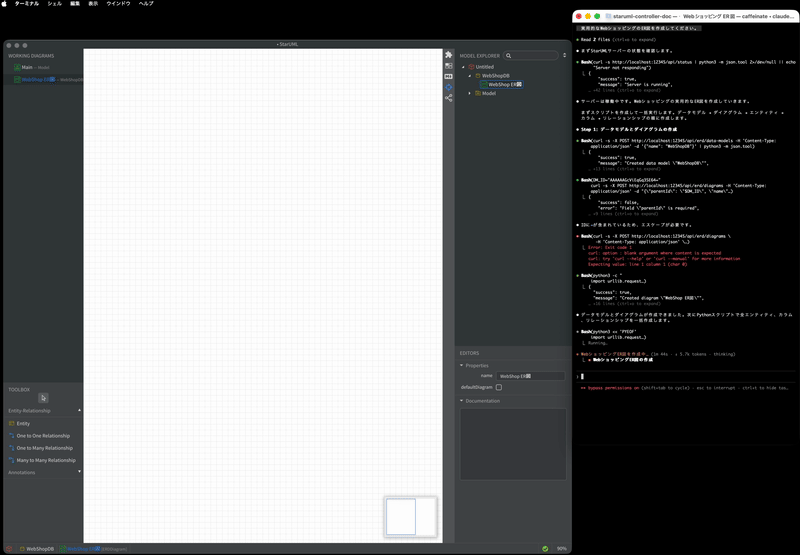
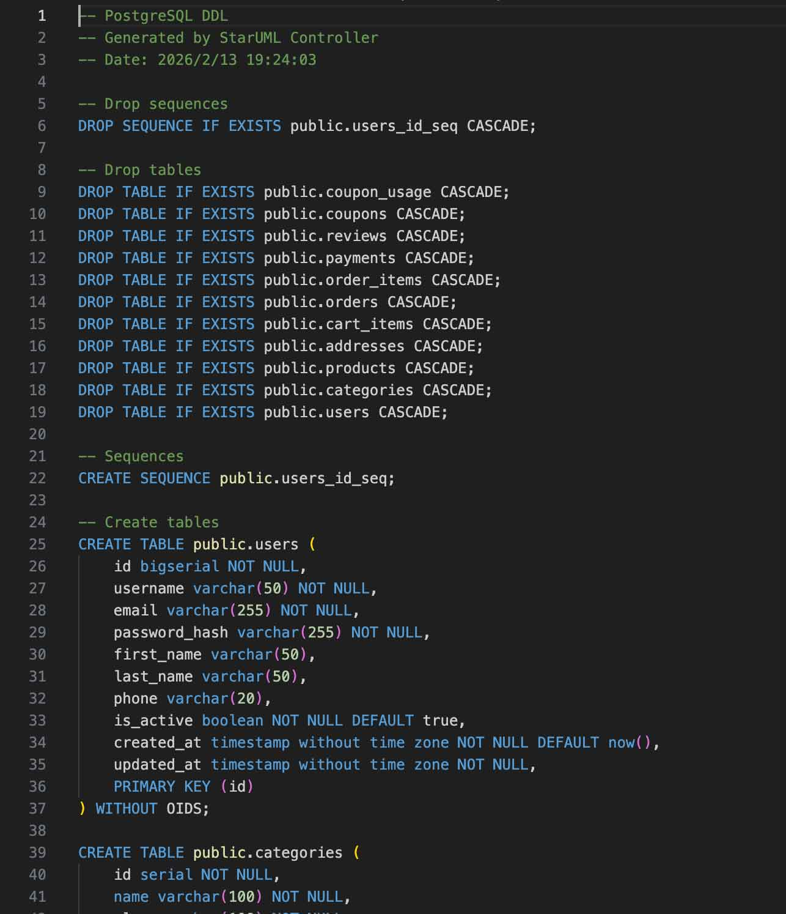
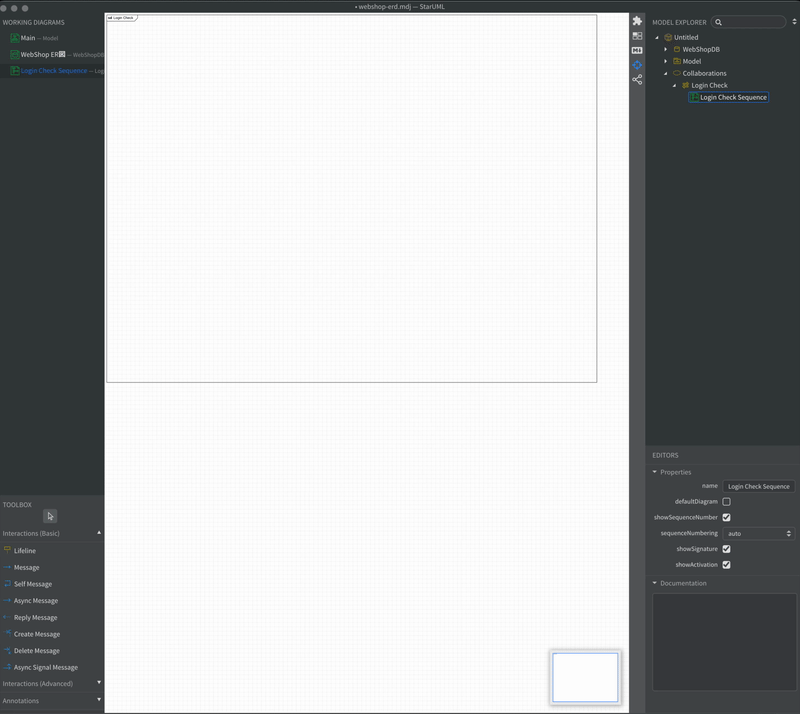
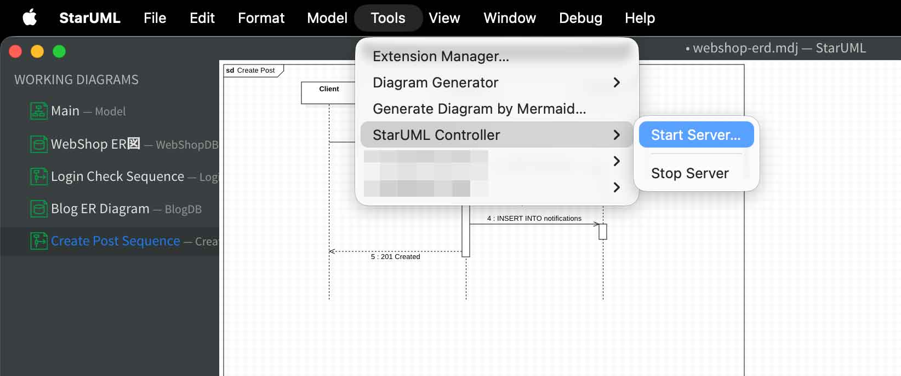
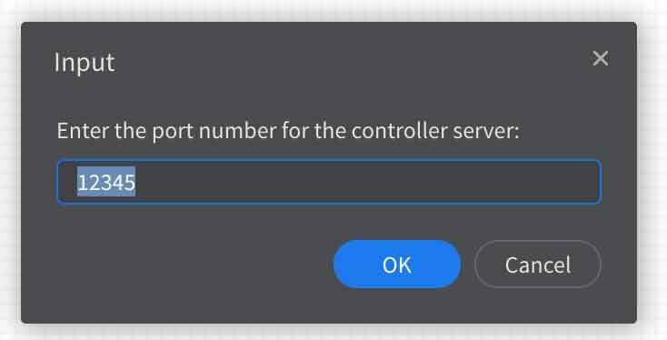

# StarUML Controller MCP Server

An MCP (Model Context Protocol) server that exposes all 85 endpoints of [StarUML Controller](https://github.com/pontasan/staruml-controller) as tools. This enables AI assistants like Claude to programmatically read and edit ER diagrams and sequence diagrams in StarUML.

<p align="center">
  
  <br>
  <em>An AI tool creating a complete Web Shopping ER diagram through the StarUML Controller API</em>
</p>

<p align="center">
  
  <br>
  <em>PostgreSQL DDL exported from the ER diagram</em>
</p>

<p align="center">
  
  <br>
  <em>An AI tool analyzing source code and generating a sequence diagram</em>
</p>

## Prerequisites

- **Node.js 18+**
- **StarUML** with the [StarUML Controller](https://github.com/pontasan/staruml-controller) extension installed and running

## Setup

```bash
git clone https://github.com/pontasan/staruml-controller-mcp.git
cd staruml-controller-mcp
npm install
npm run build
```

## Starting the StarUML Controller Server

Before using the MCP server, you need to start the StarUML Controller server:

1. **Launch StarUML** and open a project (or create a new one)

2. From the menu bar, select **Tools > StarUML Controller > Start Server...**

<p align="center">
  
</p>

3. A dialog appears asking for the port number. Enter a port (default: `12345`) and click **OK**

<p align="center">
  
</p>

4. The HTTP server starts and all diagrams become accessible via the MCP tools

To stop, select **Tools > StarUML Controller > Stop Server** from the menu bar.

## Usage with Claude Desktop

Add the following to your Claude Desktop configuration file:

- macOS: `~/Library/Application Support/Claude/claude_desktop_config.json`
- Windows: `%APPDATA%\Claude\claude_desktop_config.json`

```json
{
  "mcpServers": {
    "staruml-controller": {
      "command": "node",
      "args": ["/absolute/path/to/staruml-controller-mcp/dist/index.js"]
    }
  }
}
```

## Usage with Claude Code

Add the MCP server to your project or global scope:

```bash
# Project scope
claude mcp add staruml-controller node /absolute/path/to/staruml-controller-mcp/dist/index.js

# Global scope
claude mcp add --scope user staruml-controller node /absolute/path/to/staruml-controller-mcp/dist/index.js
```

## Available Tools (85)

All tools accept optional connection parameters: `host` (default: `localhost`) and `port` (default: `12345`). To connect to a StarUML instance on another machine, specify `host` (e.g., `"192.168.1.100"`).

### General (9 tools)

| Tool | Description |
|---|---|
| `get_status` | Get server status, version, and endpoint list |
| `get_element` | Get any element by ID |
| `list_element_tags` | List tags on an element |
| `create_element_tag` | Create a tag on an element |
| `get_tag` | Get tag details |
| `update_tag` | Update a tag |
| `delete_tag` | Delete a tag |
| `save_project` | Save project to a .mdj file |
| `open_project` | Open a .mdj project file |

### ERD (36 tools)

ER diagrams are the source of truth for database schema. When modifying DDL, always update ER diagrams first, then use `erd_generate_ddl`.

| Resource | Tools |
|---|---|
| Data Models | `erd_list_data_models`, `erd_create_data_model`, `erd_get_data_model`, `erd_update_data_model`, `erd_delete_data_model` |
| Diagrams | `erd_list_diagrams`, `erd_create_diagram`, `erd_get_diagram`, `erd_update_diagram`, `erd_delete_diagram` |
| Entities | `erd_list_entities`, `erd_create_entity`, `erd_get_entity`, `erd_update_entity`, `erd_delete_entity` |
| Columns | `erd_list_columns`, `erd_create_column`, `erd_get_column`, `erd_update_column`, `erd_delete_column` |
| Sequences | `erd_list_sequences`, `erd_create_sequence`, `erd_get_sequence`, `erd_update_sequence`, `erd_delete_sequence` |
| Indexes | `erd_list_indexes`, `erd_create_index`, `erd_get_index`, `erd_update_index`, `erd_delete_index` |
| Relationships | `erd_list_relationships`, `erd_create_relationship`, `erd_get_relationship`, `erd_update_relationship`, `erd_delete_relationship` |
| DDL | `erd_generate_ddl` |

### Sequence Diagram (40 tools)

Sequence diagrams help developers understand process flows and module connections.

| Resource | Tools |
|---|---|
| Interactions | `seq_list_interactions`, `seq_create_interaction`, `seq_get_interaction`, `seq_update_interaction`, `seq_delete_interaction` |
| Diagrams | `seq_list_diagrams`, `seq_create_diagram`, `seq_get_diagram`, `seq_update_diagram`, `seq_delete_diagram` |
| Lifelines | `seq_list_lifelines`, `seq_create_lifeline`, `seq_get_lifeline`, `seq_update_lifeline`, `seq_delete_lifeline` |
| Messages | `seq_list_messages`, `seq_create_message`, `seq_get_message`, `seq_update_message`, `seq_delete_message` |
| Combined Fragments | `seq_list_combined_fragments`, `seq_create_combined_fragment`, `seq_get_combined_fragment`, `seq_update_combined_fragment`, `seq_delete_combined_fragment` |
| Operands | `seq_list_operands`, `seq_create_operand`, `seq_get_operand`, `seq_update_operand`, `seq_delete_operand` |
| State Invariants | `seq_list_state_invariants`, `seq_create_state_invariant`, `seq_get_state_invariant`, `seq_update_state_invariant`, `seq_delete_state_invariant` |
| Interaction Uses | `seq_list_interaction_uses`, `seq_create_interaction_use`, `seq_get_interaction_use`, `seq_update_interaction_use`, `seq_delete_interaction_use` |

## Architecture

```
src/
  index.ts                  # Entry point (stdio transport)
  server.ts                 # Tool registration and McpServer setup
  http-client.ts            # REST API client (native fetch)
  response-formatter.ts     # MCP response formatting
  tool-registry.ts          # Metadata-driven tool registration engine
  tools/
    general.ts              # 9 tools: status, element, tags, project
    erd/                    # 36 tools across 8 files
      data-models.ts, diagrams.ts, entities.ts, columns.ts,
      sequences.ts, indexes.ts, relationships.ts, ddl.ts
    seq/                    # 40 tools across 8 files
      interactions.ts, diagrams.ts, lifelines.ts, messages.ts,
      combined-fragments.ts, operands.ts, state-invariants.ts,
      interaction-uses.ts
```

Each tool is a declarative definition object. The `tool-registry` engine automatically handles host/port injection, URL parameter substitution, query string construction, request body building, and response formatting.

## License

MIT
